# Data source flow

This is the target path for every outside data source. A source must keep its raw evidence,
timestamps, ownership rules, and health state before it can affect the public product.

```mermaid
flowchart LR
    subgraph Sources[Outside sources]
        SEC[SEC filings and facts]
        Yahoo[Yahoo universe and bars]
        Nasdaq[Nasdaq trading halts]
        Vendor[Quote and news vendor]
        Events[ClinicalTrials.gov, FDA, FINRA]
        Macro[FRED and other market context]
    end

    Registry[Source registry<br/>terms, credentials, cadence, display rules]
    Collect[Source collector<br/>fetch, retry, rate limit]
    Batch[SourceFetch and SourceBatch<br/>source times and collection time]

    Raw[(Raw audit trail<br/>ingestion_runs, source_documents, ingestion_items)]
    Normal[(Normalized data<br/>bars, quotes, events, facts, links, macro values)]
    Health[Ingestion health<br/>healthy, stale, idle, failed, disabled]
    Link[Issuer and ticker linking<br/>confidence and valid dates]
    Features[Derived evidence<br/>spread, halt state, dilution, catalysts, regime]
    Shadow[Shadow validation<br/>coverage, delay, revisions, model effect]
    Product[Product use<br/>ticker evidence, safety state, runner score]

    Sources --> Registry --> Collect --> Batch
    Batch --> Raw
    Batch --> Normal
    Raw --> Health
    Normal --> Health
    Normal --> Link --> Features
    Normal --> Features
    Features --> Shadow --> Product
```

## Current source routes

| Source | Collector output | Normalized destination | First product use | State |
| --- | --- | --- | --- | --- |
| SEC company map | Raw JSON plus fetch run | `sec_companies` | Map CIKs to listed tickers | Live |
| SEC current filings and documents | Raw Atom, JSON, XML, and fetch runs | `sec_filings` and `source_item_state` | Filing catalyst evidence | Live |
| SEC Company Facts | Raw JSON plus point-in-time facts | `issuer_facts` | Share growth, cash runway, current ratio, and debt-to-cash risk | Live |
| Yahoo universe | Screener rows plus fetch run | `ingestion_items` | Choose the scan universe | Live, display review required |
| Yahoo price bars | Ticker data frames plus fetch run | `market_bars` | Momentum, volume, and price features | Live, display review required |
| Nasdaq trading halts | Raw RSS plus versioned halt events | `market_events` | Halt evidence, safety penalty, and hard veto | Built and connected; approval blocked by terms review |
| Fintel short and borrow | Normalized API responses | `short_data_cache` and frozen scan facts | Dated crowding evidence | Optional licensed integration |

The Nasdaq worker is enabled only when `NASDAQ_TRADE_HALTS_ENABLED=true`. It polls once per minute
from 4:00 a.m. to 8:00 p.m. Eastern on weekdays. An active halt blocks the normal trade decision,
but the source still raises a policy warning until its public-use review is approved.

## Product routing during the POC

- **Pulse** starts with the newest saved Yahoo scanner run. Its score shows separate market, SEC,
  news-search, public-social, community-activity, and safety components.
- **Radar** automatically publishes recent SEC filings, strongly matched Yahoo news, meaningful
  Reddit mention growth from ApeWisdom, and normalized market events. It groups repeated events by
  ticker, keeps the newest state, and links back to the original source.
- **Alpha** is the social view. Comments determine the order; market and event data provide context
  but do not change the community ranking. Yahoo coverage and Reddit mention counts are shown as
  outside context, separate from Runner Watch comments.

The discovery worker rotates across 30 symbols: 10 current Pulse leaders, up to 10 Alpha activity
leaders, then the next Pulse names as a flex group. One symbol is searched every 30 seconds, so the
full set is normally refreshed about every 15 minutes. Yahoo news search and ApeWisdom's public
Reddit trend API need no API key. Only article metadata and aggregate mention/upvote counts are
stored; article bodies and social post text are not stored. A Reddit trend is ignored unless it has
at least five mentions and either three new mentions or twenty total mentions. GDELT and Bluesky
adapters remain available but are disabled by default because their public endpoints were not
reliable from the production network.

OpenBB is a provider integration framework rather than a data source. The POC keeps the direct
Yahoo collector because OpenBB's free Yahoo provider uses the same underlying source. A later
OpenBB adapter can feed its actual provider name through the existing source registry and shared
normalization layer without changing these three product routes.

## Planned source routes

| Phase | Source | Normalized destination | Derived evidence | Promotion rule |
| --- | --- | --- | --- | --- |
| 3 | Alpaca or another licensed vendor | `security_quotes`, `market_bars`, `market_events` | Spread, quote age, trade count, cleaner bars | Meet coverage and licensing gates |
| 3 | Licensed news and corporate actions | `market_events` | Non-SEC catalyst and split state | Metadata first; no full text without rights |
| 4 | ClinicalTrials.gov and FDA | `entity_links`, `market_events` | Trial changes and confirmed FDA actions | High-confidence issuer matches only |
| 5 | FINRA | Dedicated crowding facts or `market_events` | Short interest and daily short-sale volume | Keep the two measures clearly separate |
| 5 | FRED and ALFRED | `macro_observations` | Rates, volatility, yields, and credit regime | Preserve publication vintages |
| 5+ | SEC fails to deliver and USAspending | Research events and facts | Slow crowding and contract evidence | Research only until mapping quality passes |

## Rules at each stage

1. **Register:** record the owner, terms, credential name, cadence, storage rule, display rule, and
   attribution. A feed that needs review stays disabled or shadow-only.
2. **Collect:** respect the source schedule and rate limit. Record failures as durable runs.
3. **Preserve:** keep event time, source publication time, effective time, and collection time when
   they exist. Archive raw data when the source policy allows it.
4. **Normalize:** write one of the shared record types with a stable source key. A bad projection
   rolls back the batch but leaves its failed run visible.
5. **Link:** map outside entities to CIKs and tickers with a confidence score and valid dates. Low
   confidence links remain internal.
6. **Measure:** report freshness, coverage, duplicate rate, revision rate, mapping precision, and
   collection errors through the ingestion status view.
7. **Validate:** observe the source in shadow mode before it affects public evidence or ranking.
8. **Promote:** add a source to the product only after its quality and legal gates pass. Safety
   states such as trading halts can change wording or suppress alerts without becoming score boosts.

## Next build order

1. Complete the Nasdaq terms review and decide whether the connected halt path can be public.
2. Run a small licensed quote pilot into `security_quotes` and measure coverage for ten sessions.
3. Add entity-link review tools before ingesting biotech, FDA, or contract data at scale.
4. Build the source-backed biotech calendar only after the issuer-link precision gate passes.
