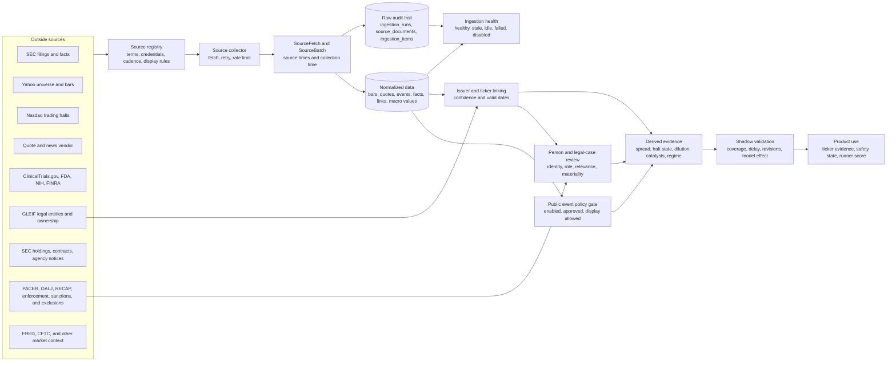

# Data source flow

This is the target path for every outside data source. A source must keep its raw evidence,
timestamps, ownership rules, and health state before it can affect the public product.

## Current source routes

| Source | Collector output | Normalized destination | First product use | State |
| --- | --- | --- | --- | --- |
| SEC company map | Raw JSON plus fetch run | `sec_companies` | Map CIKs to listed tickers | Live |
| SEC current filings and documents | Raw Atom, JSON, XML, and fetch runs | `sec_filings` and `source_item_state` | Filing catalyst evidence | Live |
| SEC Company Facts | Raw JSON plus point-in-time facts | `issuer_facts` | Share growth, cash runway, current ratio, and debt-to-cash risk | Live |
| Yahoo universe | Screener rows plus fetch run | `ingestion_items` | Choose the scan universe | Live, display review required |
| Yahoo price bars | Ticker data frames plus fetch run | `market_bars` | Momentum, volume, and price features | Live, display review required |
| Nasdaq trading halts | Raw RSS plus versioned halt events | `market_events` | Internal review until approval; then halt evidence, safety penalty, and hard veto | Built and connected; public effects blocked by terms review |
| Fintel short and borrow | Normalized API responses | `short_data_cache` and frozen scan facts | Dated crowding evidence | Optional licensed integration |
| SEC reporting people | Form 4 reporting-owner CIK plus named beneficial owners | `filing_people` and `filing_person_issuer_links` | Build a private, reviewable person-to-ticker map | Built; every person and issuer link starts pending |
| PACER Case Locator | Party-search index metadata plus billed fetch audit | `legal_case_candidates` | Private legal-case review context | Parser and review queue built; live access disabled |
| DOL OALJ | Public decision metadata and official links | `legal_case_candidates` | Private labor-case review context | Parser built; collector waits for an approved access method |
| CourtListener RECAP | Federal docket and filing metadata already in RECAP | `legal_case_candidates` | Lower-cost first pass before PACER | Registered pilot; collector not yet connected |
| OFAC SDN | Official XML snapshot with names, aliases, record IDs, and programs | `legal_case_candidates` plus source hash | Private sanctions match review | Opt-in daily collector built; disabled by default |
| SAM.gov exclusions | Exact-name API response with exclusion type, agency, UEI, and dates | `legal_case_candidates` plus fetch audit | Private federal-exclusion review | Opt-in, key-backed collector built with a five-person default daily budget |
| HHS-OIG LEIE | Official current CSV with public IDs, exclusion type, and dates | `legal_case_candidates` plus source hash | Private healthcare-exclusion review | Opt-in daily collector built; disabled by default |
| Other free official archives | Normalized records from GovInfo, SEC, DOJ, FTC, PCAOB, OCC, FDIC, FINRA, EPA, OSHA, NLRB, FDA, USITC, CFPB, CMS, FEC, and USAspending | `legal_case_candidates` and ingestion audit | Private official-record review | Registered reviewed-import contract; source-specific automation stays disabled until its supported access path is confirmed |

The Nasdaq worker is enabled only when `NASDAQ_TRADE_HALTS_ENABLED=true`. It polls once per minute
from 4:00 a.m. to 8:00 p.m. Eastern on weekdays. The saved event stays internal until the source's
catalog policy is promoted to approved public display. That promotion makes an active halt block
the normal trade decision.

## Product routing during the POC

- **Pulse** starts with the newest saved Yahoo scanner run. Its score shows separate market, SEC,
  approved-news, approved-social, public-Call, and approved-safety components.
- **Radar** publishes recent SEC filings and approved normalized market events. Proof-of-concept
  Yahoo news, ApeWisdom, Bluesky, GDELT, and Nasdaq halt events stay out of the public view until
  their source policy is approved.
- **Alpha** is the social view. Active public Calls determine the order; market and event data
  provide context but do not change the Call ranking. Only approved outside events may appear as
  context. Flash reports do not enter this feed or change its ranking, even when an owner chooses
  to publish one.

The discovery worker rotates across 30 symbols: 10 current Pulse leaders, up to 10 Alpha Call
leaders, then the next Pulse names as a flex group. One symbol is searched every 30 seconds, so the
full set is normally refreshed about every 15 minutes. Yahoo news search and ApeWisdom's public
Reddit trend API need no API key, but their collected results remain internal pilots. Only article
metadata and aggregate mention/upvote counts are
stored; article bodies and social post text are not stored. A Reddit trend is ignored unless it has
at least five mentions and either three new mentions or twenty total mentions. GDELT and Bluesky
adapters remain available but are disabled by default because their public endpoints were not
reliable from the production network.

OpenBB is a provider integration framework rather than a data source. The POC keeps the direct
Yahoo collector because OpenBB's free Yahoo provider uses the same underlying source. A later
OpenBB adapter can feed its actual provider name through the existing source registry and shared
normalization layer without changing these three product routes.

## Planned source routes

| Phase | Source | Normalized destination | Derived evidence | Promotion rule |
| --- | --- | --- | --- | --- |
| 3 | Alpaca or another licensed vendor | `security_quotes`, `market_bars`, `market_events` | Spread, quote age, trade count, cleaner bars | Meet coverage and licensing gates |
| 3 | Licensed news and corporate actions | `market_events` | Non-SEC catalyst and split state | Metadata first; no full text without rights |
| 4 | ClinicalTrials.gov and FDA | `entity_links`, `market_events` | Trial changes and confirmed FDA actions | High-confidence issuer matches only |
| 5 | FINRA | Dedicated crowding facts or `market_events` | Short interest and daily short-sale volume | Keep the two measures clearly separate |
| 5 | FRED and ALFRED | `macro_observations` | Rates, volatility, yields, and credit regime | Preserve publication vintages |
| 5+ | SEC fails to deliver and USAspending | Research events and facts | Slow crowding and contract evidence | Research only until mapping quality passes |
| 5+ | openFDA shortages and enforcement reports | `entity_links`, `market_events` | Drug supply and recall risk | Material event plus reviewed issuer match only |
| 5+ | NIH RePORTER | `entity_links`, `market_events` | Grant awards and research-program context | Match the funded organization, not a keyword |
| 5+ | GLEIF | `entity_links` | Legal names, parent links, and mapped identifiers | Use as mapping evidence; fuzzy matches stay in review |
| 5+ | FINRA OTC transparency | Dedicated crowding facts | Delayed off-exchange activity | Keep separate from short volume and short interest |
| 6 | SEC 13F and N-PORT | Dedicated ownership facts | Delayed institutional and fund holdings | Research only; never describe as live flow |
| 6 | Federal Register | `entity_links`, `market_events` | Contract notices and agency actions | Reviewed entity or product links only |
| 6 | CFTC Commitments of Traders | `macro_observations` | Weekly market and sector positioning | Market context only; preserve the release date |
| 6 | PACER, DOL OALJ, CourtListener RECAP, and free official archives | `filing_people`, `filing_person_issuer_links`, `legal_case_candidates` | Reviewed legal and regulatory context tied to SEC-listed people | Approve identity, issuer link, record relevance, and materiality separately; no score effect |

## Rules at each stage

1. **Register:** record the owner, terms, credential name, cadence, storage rule, display rule, and
   attribution. A feed that needs review stays disabled or shadow-only.
2. **Collect:** respect the source schedule and rate limit. Record failures as durable runs.
3. **Preserve:** keep event time, source publication time, effective time, and collection time when
   they exist. Archive raw data when the source policy allows it.
4. **Normalize:** write one of the shared record types with a stable source key. A bad projection
   rolls back the batch but leaves its failed run visible.
5. **Link:** map outside entities to CIKs and tickers with a confidence score and valid dates. Low
   confidence links remain internal.
6. **Measure:** report freshness, coverage, duplicate rate, revision rate, mapping precision, and
   collection errors through the ingestion status view.
7. **Validate:** observe the source in shadow mode before it affects public evidence or ranking.
8. **Promote:** add a source to the product only after its quality and legal gates pass. Safety
   states such as trading halts can change wording or suppress alerts without becoming score boosts.

Legal and regulatory records add one stricter rule: a shared name never creates a ticker risk fact.
The SEC person, issuer relationship, outside subject, role, and record relevance must each be
reviewed. Being named in a filing, case, complaint, sanction search result, inspection, payment, or
award is not evidence of misconduct.

## Next build order

1. Complete the Nasdaq terms review and decide whether the connected halt path can be public.
2. Run a small licensed quote pilot into `security_quotes` and measure coverage for ten sessions.
3. Add entity-link review tools before ingesting biotech, FDA, or contract data at scale.
4. Build the source-backed biotech calendar only after the issuer-link precision gate passes.
5. Pilot the added free sources in this order: GLEIF mapping, openFDA and NIH events, FINRA OTC
   context, then the slower ownership, contract, agency, and futures-regime feeds.
6. Run the legal-risk shadow pilot: review SEC people, enable OFAC/HHS snapshots, add a small SAM
   key budget, search RECAP first, use tightly budgeted PACER only for gaps, and add DOL OALJ after
   its collection method is approved.
